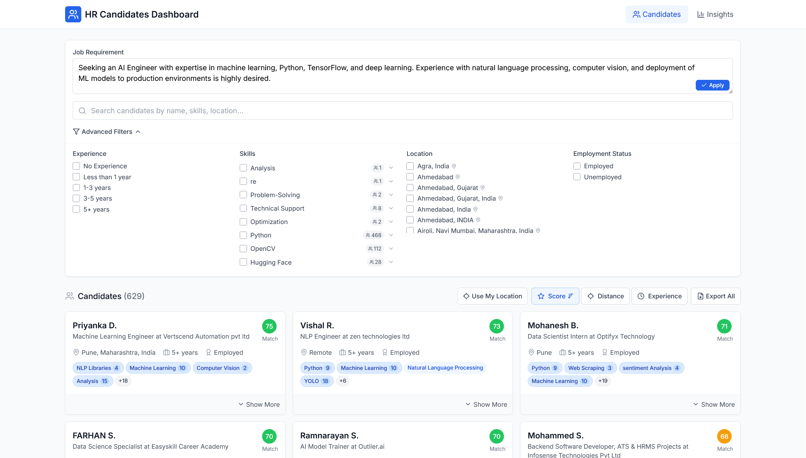
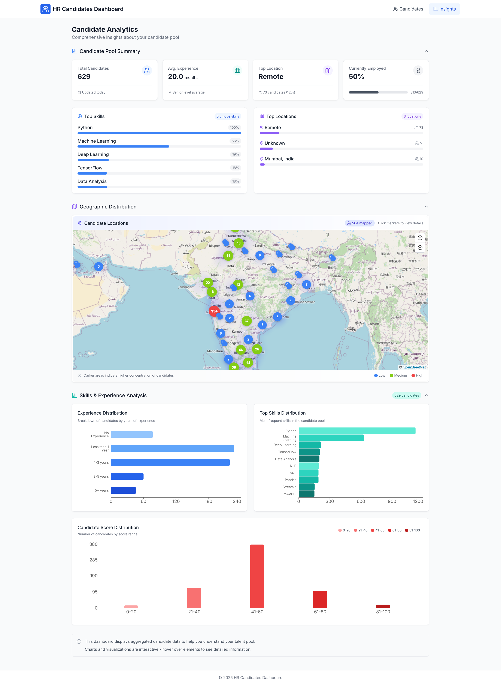

# HR Candidates Dashboard

A beautiful, modern React TypeScript application for HR professionals to manage job candidates. This dashboard enables filtering, sorting, and comparison of thousands of resumes, with AI-powered recommendations that rank candidates based on your specific job requirements.

## Screenshots

### Candidates Dashboard


### Analytics & Insights


## Features

- **Resume Parsing**: Upload resumes to extract structured data automatically.
- **Candidate Browsing**: View and sort a list of job candidates with their key information.
- **Advanced Filtering**: Filter candidates by experience level, skills, location, and employment status.
- **Job Requirement Matching**: Input job requirements and see candidates ranked by relevance.
- **Skills Normalization**: Group similar skills (e.g., "React", "ReactJS", "React.js") for better filtering.
- **Location-based Sorting**: Sort candidates by proximity to a specified location.
- **Data Visualization**: View insights about candidate skills and experience distribution.
- **Responsive Design**: Works on desktop and mobile devices.

## Technology Stack

- **Frontend**: React 18 with TypeScript
- **Routing**: React Router v6
- **Styling**: Tailwind CSS
- **Charts**: Recharts
- **Icons**: Lucide React
- **Date Handling**: date-fns
- **Build Tool**: Vite

## Project Architecture

```
src/
├── components/ - Reusable UI components
│   ├── dashboard/ - Dashboard-specific components
│   ├── insights/ - Data visualization components
│   └── layout/ - Layout components like header, sidebar
├── data/ - Data fetching and manipulation
├── pages/ - Top-level page components
│   ├── Dashboard.tsx - Main candidate browsing page
│   └── Insights.tsx - Analytics and data visualization page
├── types/ - TypeScript type definitions
├── utils/ - Utility functions
│   ├── filterUtils.ts - Filtering and sorting logic
│   ├── skillNormalizationUtils.ts - Skill grouping logic
│   └── tfidfUtils.ts - Text matching algorithms
└── App.tsx - Main application component
```

## Key Features Implementation

### Candidate Dashboard
- **Candidate Filtering**: Uses useMemo hooks and efficient filter functions to maintain performance with large datasets.
- **Skill Normalization**: Implements algorithms to group similar skills, improving the filtering experience.
- **Score Calculation**: Calculates candidate relevance scores based on experience, skills, and job requirement matching.
- **TF-IDF**: Utilizes Term Frequency-Inverse Document Frequency for matching job descriptions to candidate skills and experience.

### Insights & Analytics Page
The Insights page provides comprehensive analytics about the candidate pool with three main sections:

1. **Candidate Pool Summary**
   - Key metrics about the candidate pool (total candidates, average experience, etc.)
   - Experience level distribution
   - Employment status breakdown

2. **Geographic Distribution**
   - Interactive location heatmap showing candidate geographic distribution
   - Region-based candidate density visualization

3. **Skills & Experience Analysis**
   - Top skills among candidates with frequency visualization
   - Experience distribution charts
   - Skill clustering and relationship visualization
   - Interactive chart elements with detailed tooltips

The Insights page is built with modular components for maintainability and features collapsible sections for better user experience.

## Setup and Installation

### Prerequisites

- Node.js (v14.0 or higher)
- npm or yarn

### Installation

1. Clone the repository:
   ```bash
   git clone <repository-url>
   cd hr-candidates-dashboard
   ```

2. Install dependencies:
   ```bash
   npm install
   # or
   yarn install
   ```

3. Start the development server:
   ```bash
   npm run dev
   # or
   yarn dev
   ```

4. Open [http://localhost:3000](http://localhost:3000) in your browser.

### Building for Production

```bash
npm run build
# or
yarn build
```

The build output will be in the `dist` directory.

## Deployment

The application is configured for deployment on Vercel. Simply connect your repository to Vercel for automatic deployments.

## Data Source

The dashboard displays data extracted from candidate resumes, including:
- Personal information and contact details
- Work experience 
- Projects
- Skills

## License

[MIT License](LICENSE) 